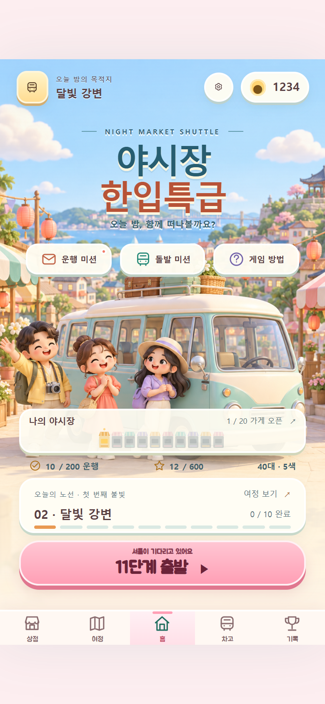
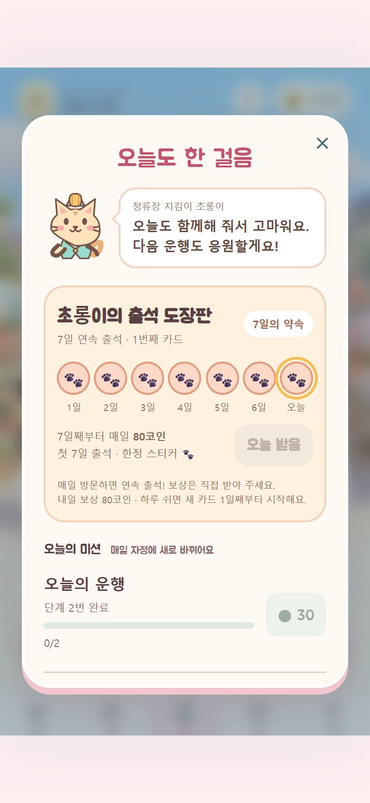
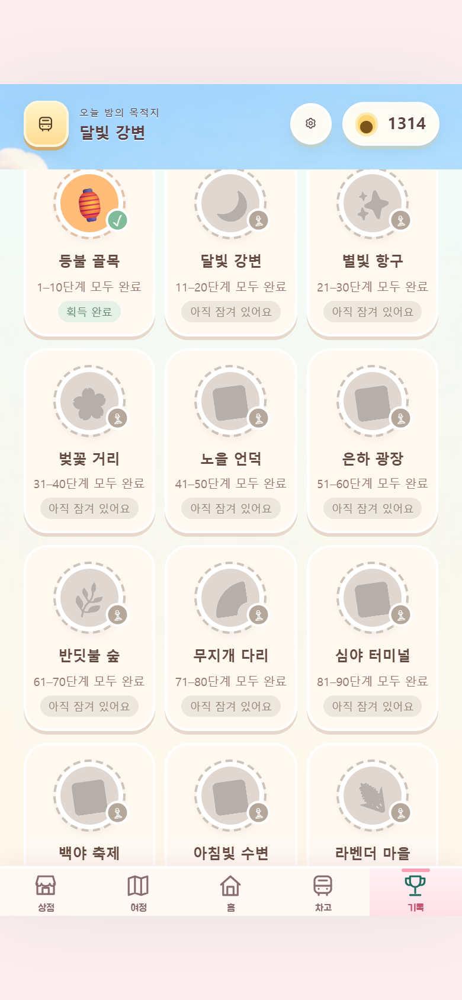
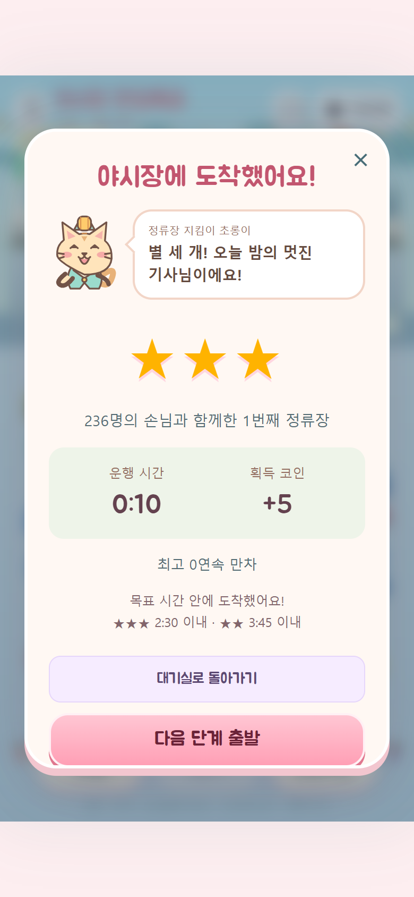
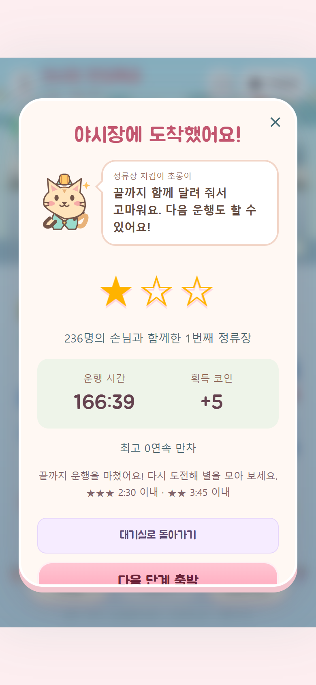
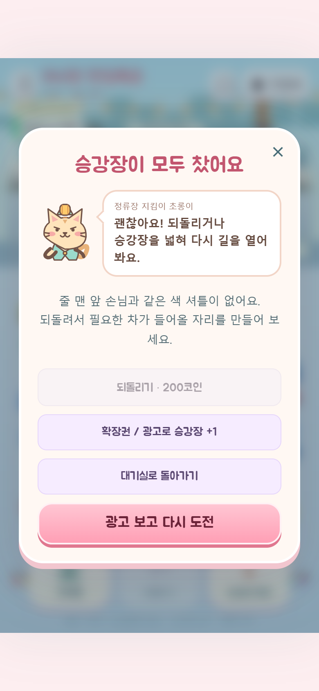
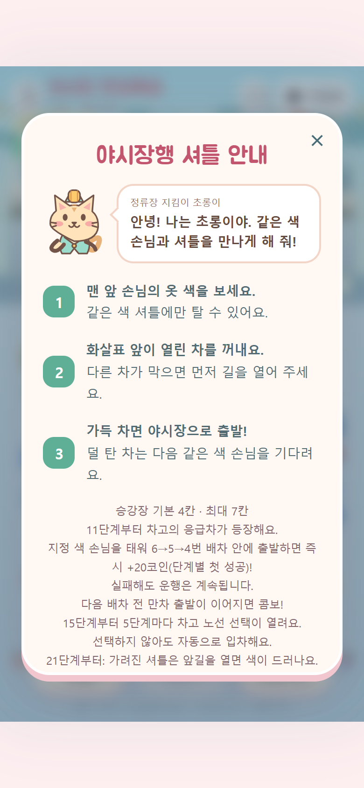

# v61 마스코트·출석판·도감 검증

## A 핵심 결론

2026-09-28 Codex HvsO. Git v60 기반의 귀여운 UI 3차를 v61 / 0.20.0에 구현했다. 원본의 Android 0.17.2 브리지를 보존해 APK 코드 2로 통합했다. 게임 규칙과 출석·미션·아이템 가격은 변경하지 않았다. 웹 main 배포는 이번 작업에 포함하지 않았다.

## B 범위

- 초롱이 고양이 역무원 SVG 4표정. 안내·미션·성공·실패 모달에 72px로 배치.
- 7칸 출석판, 연속 방문/단절, 다음 카드 번호, 보상 수령 도장·효과음. 수령하지 않은 날은 흐리게 표시하며 코인을 소급 지급하지 않는다.
- 25종 스티커: 20개 지역 전체 완료, 7일 출석, 별 3개 누적 50/100/200회, 7콤보.
- 기존 기록 소급 지급, 중복/알 수 없는 ID 제거, 재접속 유지. 스티커는 코인 추가 지급 없음.
- v61 캐시, 새 모듈/폰트 오프라인 보관, 움직임 줄이기.

## C 결과

| 검증 | 결과 |
|---|---|
| 원본 구문 검사 | 통과 |
| 원본 전체 단위·회귀 | 140/140 |
| 출석·스티커·마스코트 관련 | 14/14 (전체에 포함) |
| 정적 파일·캐시·버전 검사 | 문제 0건 |
| 200단계 엔진 자동 플레이 | 새치기 거절 200/200, 수락 200/200 |
| 모바일 브라우저 E2E | 12/12, 실제 DOM 배차 40회로 1단계 완료 |
| 3차 UI 전용 E2E | 18/18, 390×844 |
| Android release 빌드 | 성공 / 0.20.0 / versionCode 2 |
| APK 서명 | 기존 인증서와 동일 / v2 검증 통과 |
| APK 자산 검사 | 마스코트·출석·스티커 JS/CSS 원본과 일치, 네이티브 브리지·정책·폰트 포함 |

## D 한계

- Android debug APK 설치는 성공했으나 에뮬레이터 Android System UI 응답 없음으로 연령 선택 UI 자동 검증이 두 번 실패했다. 실기기 설치·터치·광고 완료/취소·음질 검증은 확인 못 함. 통과로 계산하지 않는다.
- UI 결과창은 테스트 서버에서 성공/실패 상태를 넣어 그리기 경로를 검증했다. 실제 1단계 클릭 플레이와 200단계 엔진 테스트는 별도 수행했다.
- 기존 브라우저 봇의 '맨 앞 색 우선' 휴리스틱은 18회 배차 후 패배했다. 게임 변경 없이 검증된 해법 순서와 움직임 종료 대기로 수정했다. 테스트 서버의 상태 관찰 getter는 읽기 전용이고 출시 파일에 없다.
- 오프라인 브라우저의 기본 favicon 요청 오류를 막기 위해 이미 캐시된 회사 로고를 명시했다.
- 별 기준은 v59 설계값을 유지했다. 플레이어 난이도/선호의 실측은 아니다.
- 원본 작업 폴더의 미커밋 Yue2 BGM 변경은 보존했으며 이번 버전에 포함하지 않았다.
- 본 리포트는 구현·검증 기록이다. 스토어 검증 요청·판매중 상태는 별도 출시 기록과 노션의 최신 조회 결과를 따른다.

## E 재현 근거

원본: pickup-rush-color-station, codex/v61-onestore-20260928. 기반 origin/main 6129d9b + 기존 Android HEAD 4063a99.
배포 후보: pickup-rush-play, codex/v61-mascot-20260928. 기반 origin/main 6588e6a.

```sh
npm run check
npm test
# Windows에서는 NODE_PATH에 Playwright 설치 경로 지정, PLAYWRIGHT_CHANNEL=msedge
bash tools/verify/run-all.sh "reports/v61검증(20260928)v1"
node tools/verify/mascot-e2e.cjs "reports/v61검증(20260928)v1/mascot"
```

- [정적 검사](static-check.json)
- [200단계 거절](campaign-decline.json), [200단계 수락](campaign-accept.json)
- [브라우저 E2E](e2e/browser-e2e.json), [3차 UI E2E](mascot/mascot-e2e.json)








