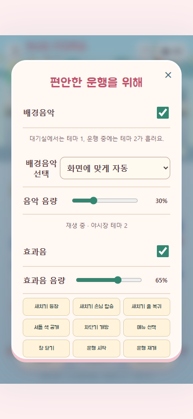

# v62 / 0.20.1 — 수정 BGM 2곡 반영

기준: 2026-09-28 Codex HvsO. 사용자의 추가 지시로 v61의 마스코트·출석판·도감에 기존 로컬 BGM 수정본을 합쳤다.

## 적용

- 대기실/메뉴: 야시장 테마 1, 116.584초.
- 운행: 야시장 테마 2, 136.829초.
- 기본 자동 전환, 설정에서 수동 선택·음량 조절·끄기. 곡 선택과 볼륨 저장.
- 한 개의 오디오 요소로 반복 재생, 곡 교체 시 페이드. 광고/백그라운드/네이티브 일시정지 중 정지, 복귀 시 이어 재생.
- 이전 lantern 선택은 자동 모드로 이전. 기존 코인·단계·스티커 기록 유지.
- 웹 캐시 pickup-rush-v62-bgm, 참조 v62. Android0.20.1/code3, 기존 패키지·서명 유지.

## 검증

- npm run check 통과. npm test **146/146** (음악 8개 포함).
- MP3 두 파일은 9월26일 보존된 수정본과 바이트 일치. FFmpeg 전체 디코딩 오류 없음, 44.1kHz 스테레오.
- 실제 Edge 브라우저 390×844: 사용자 입력 전 정지, 대기실 PCM 출력, 두 곡 전환, 한 요소 유지, 음량0/복구, 켜기/끄기, 곡 끝→처음 반복, 운행 자동 전환, 모달 음량 감소, native lifecycle 이벤트 정지/복귀, 재접속 설정 보존 통과. JavaScript오류0.
- 서비스워커 오프라인 재로딩 후 두 곡 재생 확인. 정적 캐시·파일·버전 점검0건.
- v61 출석·스티커·마스코트 UI 재검증18/18. 게임 엔진/단계 규칙은 변경하지 않아 200단계 별도 브라우저 테스트를 반복하지 않았다. 전체 단위 테스트의 200단계 검증은 통과.
- Android release 빌드 성공, apksigner 검증 통과. APK 내 MP3 두 곡·music/app/mascot/stickers 모듈이 원본과 일치.

## 파일 식별

- lobby MP3 SHA256: 5ecdb9c3113d2c07330baab0698c5c63e2039e407ad93fc1fbcc8a2474e01578
- drive MP3 SHA256: ab5eccd918b91f2d414112124919fa84aacdb96d8405f5f52b3dd2234829eab3
- APK SHA256: 1d761e330907d4d823654e7e59b7990c234eae79a6fadf1fe073f65c90350718
- APK bytes: 18834305, package com.ninetosixlab.pickuprush, code3/name0.20.1.
- 인증서 SHA256: 9599ee040d21cd55296a726292a25916a245e75836384acfbafd10c7763c6347.

## 범위와 한계

원본 BGM 수정 작업 폴더는 보존했다. 새로 음악을 생성하거나 구매하지 않았다. 웹 main은 기존 v60 유지하고 소스·배포 후보 작업 브랜치에만 반영한다. 이번 출시 대상은 원스토어 APK다.
실제 휴대폰 스피커 청취, 운영 광고 완료·취소, 실제 Android background 복귀는 확인 못 함. 브라우저 native 이벤트 검증은 Android 실기기 검증이 아니다. 원음에서 분리된 Instrumental이므로 잔여 보컬·반복 자연스러움은 청취 확인 필요.

## 재현

원본에서 npm run check 및 npm test. PORT=4192로 node server.mjs 실행 후 NODE_PATH를 Playwright 설치 경로로 지정하고 node scripts/verify-bgm-browser.mjs 실행. 공개 후보에서 node tools/verify/static-check.mjs, node tools/verify/mascot-e2e.cjs 실행.
스토어 최종 상태는 별도 원스토어 출시 기록과 노션의 최신 조회 결과를 따른다.

